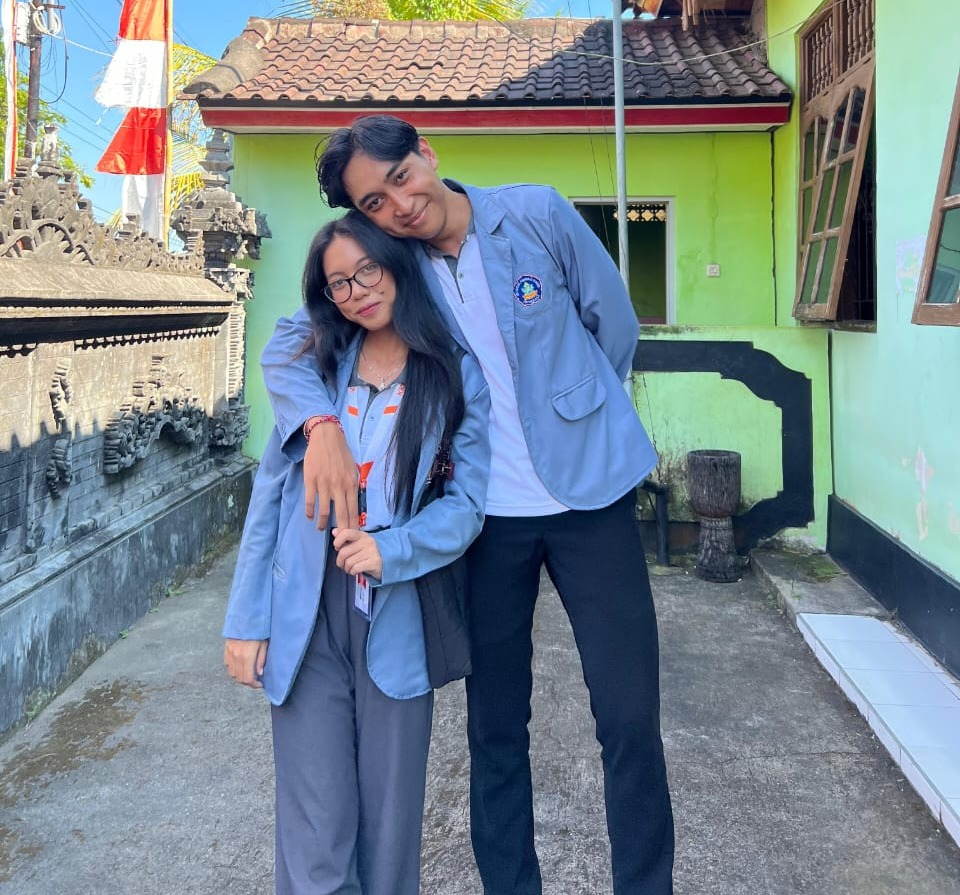

# 💍 Say Yes to Me 🌹

 <!-- Adjust the filename if it's different -->

**Date:** September 27, 2024  
**Website:** [say-yes-to-me.vercel.app](https://say-yes-to-me.vercel.app/)

---

## 🌸 About This Project

This project is a continuation of our beautiful journey, a special moment that I’ve crafted with all my heart. It’s not just a proposal—it’s a promise, a step towards something more meaningful as we walk together into the future.

On September 27, 2024, I’m inviting you to take that next step with me, to embrace the bond we’ve built, and to make our love story even more real. This is the moment where I ask you to *Say Yes to Me.* ❤️

## 💖 Features

- **Romantic and personal:** Every page and detail on this site is a reflection of my feelings for you.
- **Interactive:** Designed with love and elegance, the site creates a truly unforgettable moment for the two of us.
- **Meaningful:** Every word, image, and design symbolizes the journey we’ve been on, from the day we met to where we are now.

## ✨ My Invitation to You

This isn’t just a project—it’s a reflection of how deeply I feel about you, of everything I’ve poured into this moment. When you visit [say-yes-to-me.vercel.app](https://say-yes-to-me.vercel.app/), I hope you can feel the love, the effort, and the promises embedded in every part of it.

I’m asking you to take this next step with me, to make our love stronger, deeper, and more beautiful.

---

**With love, always,**  
Angga
